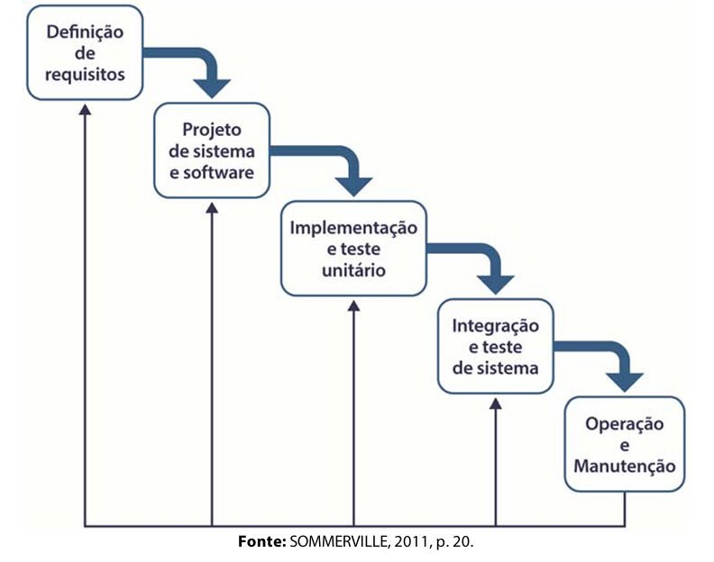

# Modelo Em Cascata ou Tradicional

O modelo conhecido como "Cascata", devido ao encadeamento entre uma fase e outra, foi o *primeiro modelo de processo de desenvolvimento de software* a ser publicado.  Também conhecido como Ciclo de Vida Clássico/Tradicional. O modelo é considerado o mais simples dentre os modelos de desenvolvimento de software, estabelecendo uma ordenação linear no que se refere à realização de diferentes etapas.

Esse modelo, é um exemplo de processo dirigido a planos, ou seja, antes de começar a executar qualquer atividade, devem ser analisadas, planejadas e estruturadas todas as atividades.
Geralmente utilizado quando os requisitos do problema em questão são conhecidos, estáveis e claros. Bastante útil em situações em que precisam realizar correções ou com a necessidade de aperfeiçoar um sistema já existente.

Como pode ser visto na figura acima, este modelo sugere uma abordagem sistemática e sequencial para o desenvolvimento de software. As principais fases do modelo em cascata refletem diretamente as atividades consideradas fundamentais no desenvolvimento de software.

1.  **Análise e Definição de Requisitos**:  As funcionalidades, restrições e objetivos dos sistemas (requisitos) são estabelecidos por meio de consulta aos usuários, clientes também especialistas. Basicamente, o levantamento de requisitos ou necessidades junto aos clientes consiste em determinar e delimitar o escopo de quais serviços devem ser fornecidos, quais as limitações e restrições e, por fim, o que se tem como meta ao desenvolver o sistema. Após o levantamento, o que foi requisitado é detalhado e funciona como uma especificação do sistema. Nesta etapa também, além da documentação, é realizado o estudo de viabilidade do projeto, que leva a determinação do processo de inicio do desenvolvimento do software.

2. **Planejamento e Projeto de sistema e Software:** durante a fase do processo de desenvolvimento de software, é definida uma arquitetura geral na qual se busca contemplar o que foi requisitado no processo de análise e definição dos requisitos. Compreende nesta etapa de planejamento a definição de cronogramas, com a estimativa de tempo de cada tarefa definida, as quais são baseadas nos requisitos estabelecidos. Também faz parte do processo de projeto a modelagem, que pode ser considerada uma prévia da próxima etapa de implementação (ou construção) do sistema. Na modelagem, define-se as estruturas de dados, interfaces, arquiteturas, ferramentas, etc.

3. **Implementação e Testes Unitários:**  nessa fase, cada unidade do programa ou conjunto de programas que compõem o projeto do software é desenvolvido. Logo,  é aqui que entra o processo de execução de testes unitários, cujo foco é a verificação de cada unidade para validar se atendem ao objetivo para as quais foram especificadas.

4. **Integração e Testes de Sistemas:**  as unidades desenvolvidas são integradas e testes também são realizados para validar a integração e assegurar que os requisitos foram implementados conforme especificados, caso esteja em conformidade com as especificações, após a execução dos testes, o sistema pode ser implantado, ou seja, entregue ao cliente ou usuário final.

5. **Operação e Manutenção:** Após o sistema ser entregue e começar efetivamente sua utilização, inicia-se a fase de manutenção (normalmente, mas não necessariamente, a fase mais longa do ciclo de vida). Nesta etapa, é feito o acompanhamento de uso do sistema, para que, se necessário, efetuar correções em erros que podem surgir ou terem passado despercebidos durante as fases anteriores, bem como, efetuar alguma melhoria nas funcionalidades que foram percebidas no dia-a-dia do usuário, ou ainda, incrementar recursos, acrescentando novos requisitos que podem surgir com o tempo ou que foram desconsiderados previamente.

No geral, cada estágio gera um artefato, normalmente um ou mais documentos. Uma característica do modelo Cascata é que a fase subsequente só se inicia com a conclusão da fase anterior, mas na prática, sabe-se que tais fases se sobrepõe e se interagem sendo *fonte de informações uma para outra*. Por exemplo, problemas com requisitos ou regras de negócio podem ser encontrados durante a fase de projeto, ou então, durante a codificação problemas de projeto podem ser identificados, necessitando de uma reavaliação do que foi planejado e assim por diante.

###  São características do Modelo Cascata:

 - Há uma divisão fixa, sequencial e inflexível do projeto em estágios distintos.
 - A fase seguinte só deve iniciar quando a anterior for concluída e aprovada pelas partes envolvidas. O projeto só começa quando os requisitos forem completamente levantados, definidos, detalhados e aprovados
 - Oferece maior previsibilidade de prazos e custos e, por consequência, facilita o planejamento e gerenciamento.

Apesar de ser o paradigma mais antigo da Engenharia de Software o Modelo Cascata ainda é utilizado. Vários autores questionam sua eficácia e os principais problemas encontrados no modo cascata são:
 -  Na realidade, os projetos raramente seguem um fluxo sequencial que o modelo Cascata pressupõe. A interação é sempre necessária quando o processo está sendo executado de fato e, então, cria-se problemas na aplicação do modelo.
 - Normalmente, o cliente não consegue estabelecer seus requisitos e necessidades de forma explícita. Logo, os requisitos, por serem a base do modelo Cascata, se não estiverem bem estabelecidos podem acarretar dificuldades no inicio dos projetos.
 - Exige bastante paciência dos clientes, o que não costuma acontecer. No modelo cascata, a versão para uso só estará disponível próximo ao final do projeto.
 - Se houver algum erro grave nas etapas iniciais (como uma especificação mal compreendida ou mal especificada) sendo identificado apenas nas etapas finais, pode resultar vários problemas, em caso extremo, a necessidade de descartar tudo e recomeçar todas as etapas
 - Pode ocorrer um bloqueio ou uma longa espera em alguns membros da equipe que precisam esperar que os outros completem as suas tarefas para que eles consigam dar sequencia as atividades à qual são designados.

Com a velocidade em que anda o desenvolvimento de software,  evolução de modelos de negócio, ferramentas e tecnologias, aumenta o potencial de ocorrer mudanças que surgem. Desde necessidades de negócio, necessidades dos clientes ou até mesmo exigências importas por órgãos regulamentadores, leis governamentais ou imposições de organizações. Neste cenário o modelo cascata se torna inapropriado, pois ele é útil em situações nas quais os requisitos são estáveis, fixos e bem conhecidos. Com um fluxo de trabalho sendo executado e finalizado de forma linear.

O modelo Cascata aplica-se bem em situações em que o sistema a ser desenvolvido é relativamente simples, os requisitos são bem conhecidos e  não suscetível de grandes alterações, a tecnologia utilizada é bem acessível e os recursos para o desenvolvimento estejam disponíveis.

